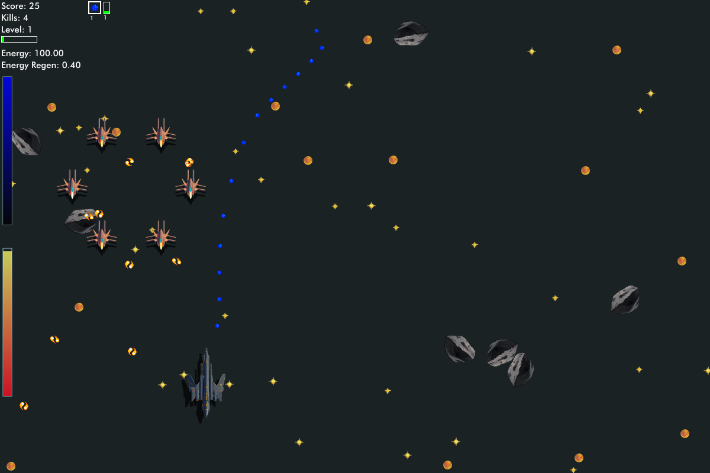

Simple 2d overhead shootem-up game

Play online: https://kazzmir.itch.io/simple-shooter

Written in golang and ebitten
https://github.com/hajimehoshi/ebiten

## Peer connection

The game now includes **Peer server**, **Peer room**, and **Connect to peer** menu options in both the desktop and wasm builds. They establish a WebRTC data channel to another running instance of the game. Gameplay state sync is not wired up yet.

To try it locally:

1. Start the signaling server with `make signaling-server` and run the binary from `./signaling-server` or `go run ./cmd/signaling-server`.
2. Start the desktop game or serve the wasm build with `make run-web` / `make build-web`.
3. In each game instance, set the same **Peer server** and **Peer room** values from the main menu, then choose **Connect to peer**.
